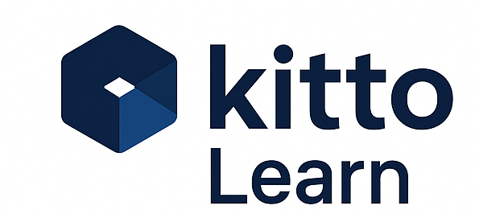
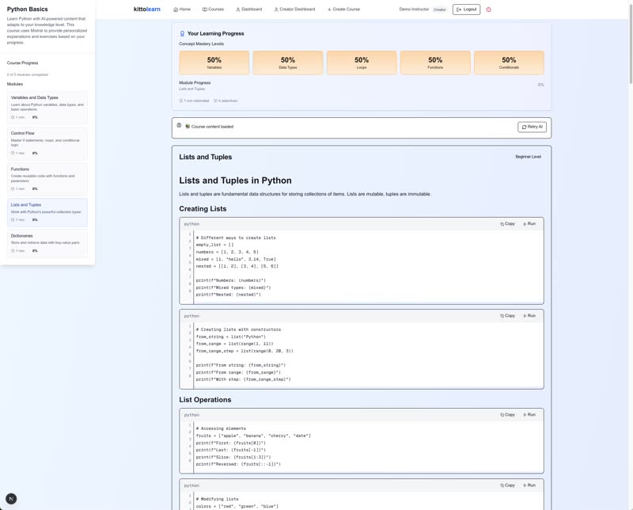

  
    
  <h1>Kitto</h1>
  
🔷 Productivity Tools for Modern Workflows

  
  

    <a href="https://github.com/kittohq/kitto/releases/latest">📥 Download Latest Release</a> | 
    <a href="mailto:kittohq@gmail.com">Contact Us</a>
  

---

## About Kitto

Kitto develops innovative productivity tools designed to enhance your workflow and learning experience. Our mission is to create software that adapts to your needs, helping you work smarter and learn faster.

---

## 🖥️ Kitto AIO (All-in-One Mac App)

**The ultimate productivity companion for macOS** - Kitto AIO brings all your essential tools into one unified interface, helping you stay focused and efficient.

### ✨ Key Features

- **Unified Dashboard** - All your productivity tools in one place
- **Smart Widgets** - Real-time stocks, calendar, timezone tracking, and Gmail integration
- **Terminal Integration** - Seamless terminal and file browser side-by-side workflow
- **Quick Preview** - Instant preview for PDFs, images, CSVs, and code files
- **Jupyter Lab Widget** - Built-in support for data science workflows
- **Smart Positioning** - Remembers your layout preferences and dashboard states

### 📦 Current Release

**Version 1.0.0** - [Download for macOS](https://github.com/kittohq/kitto/releases/latest)

- Compatible with macOS 11.0 or later
- Apple Silicon and Intel support
- Free during beta period

### 🚀 Quick Start

1. Download the latest release from [GitHub Releases](https://github.com/kittohq/kitto/releases/latest)
2. Open the DMG file and drag Kitto AIO to your Applications folder
3. Launch Kitto AIO from your Applications
4. Grant necessary permissions when prompted

### 📸 Screenshots

[View Kitto AIO in Action](https://imgur.com/a/ke5HMoM)

---

## 🎓 Kitto Learn

An AI-powered adaptive learning platform that adjusts to your pace, making learning more effective and personalized.

### Features

- **Adaptive Difficulty** - Content automatically adjusts based on your performance
- **Knowledge Gap Detection** - AI identifies what you're missing and fills the gaps
- **Non-Linear Navigation** - Jump to any topic with automatic prerequisite filling
- **Real-time Progress Tracking** - See your improvement with dynamic badges

### 📹 Demo

*▶️ Click to watch the Kitto Learn platform in action*

### How It Works

  <table>
    <tr>
      <td align="center">
        <strong>🔴 When You Struggle</strong> 
        Score < 40% 
        ↓ 
        Content Gets EASIER
      </td>
      <td align="center">
        <strong>🟢 Perfect Zone</strong> 
        Score 40-85% 
        ↓ 
        Optimal Challenge
      </td>
      <td align="center">
        <strong>🟣 When You Excel</strong> 
        Score > 85% 
        ↓ 
        Content Gets HARDER
      </td>
    </tr>
  </table>

### Access

Kitto Learn is currently in private beta. [Request access](mailto:kittohq@gmail.com?subject=Request%20Demo%20Access%20for%20Kitto%20Learn) to try the platform.

---

## 🛠️ Support

- **Email**: kittohq@gmail.com
- **Issues**: [GitHub Issues](https://github.com/kittohq/kitto/issues)
- **Documentation**: Coming soon

---

## 📄 License

© 2024 Kitto. All rights reserved.

---

  Built with ❤️ by the Kitto Team

