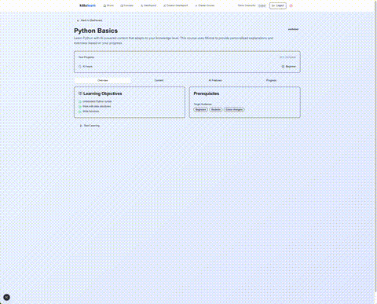

  
  
  <h1>Kitto Learn</h1>
  
🔵 🟦 📦 🤖 AI-Powered Adaptive Learning Platform

  
  

    <a href="mailto:kittohq@gmail.com?subject=Request%20Demo%20Access%20for%20Kitto%20Learn">Request Demo Access</a>
  

## 📹 Demo Video

Watch the Kitto Learn adaptive learning platform in action (click to watch full video):

*Click the GIF above to download and watch the full demo video (23MB, 2:31 duration)*

  <table>
    <tr>
      <td align="center">
        <strong>🔴 When You Struggle</strong> 
        Score < 40% 
        ↓ 
        Content Gets EASIER
      </td>
      <td align="center">
        <strong>🟢 Perfect Zone</strong> 
        Score 40-85% 
        ↓ 
        Optimal Challenge
      </td>
      <td align="center">
        <strong>🟣 When You Excel</strong> 
        Score > 85% 
        ↓ 
        Content Gets HARDER
      </td>
    </tr>
  </table>

---

## About Kitto Learn

**Kitto Learn** is an AI-powered adaptive learning platform that adjusts to your pace. Watch content get easier when you struggle, harder when you succeed.

### 🖥️ What You'll See

When you visit the platform, you'll find:
- **Robot mascot** with floating geometric shapes (the Kitto Learn character)
- **Live demo cards** showing three adaptive scenarios
- **Course selection** for Python Fundamentals and Statistics
- **Real-time badges** that change based on your performance
- **Clean interface** with blue gradients and modern design

### 🎯 Live Demo Ready!

Test our adaptive learning system with **Python Fundamentals** or **Statistics**:

1. Click "Try Live Demo" and choose a course
2. Navigate to any module and click "Take Assessment"
3. Your score determines what happens next:
   - **Score < 40%** → Content becomes EASIER (beginner level)
   - **Score > 85%** → Content becomes HARDER (advanced level)
   - **Score 40-85%** → Stay at current level
4. Watch the difficulty badge change in real-time!
5. See personalized content adapted to your level

### 📐 Adaptive Learning in Action

**When You Struggle (Score < 40%)**
- Switch to simpler explanations
- Add more examples and analogies
- Break concepts into smaller steps

**Perfect Challenge Level (Score 40-85%)**
- Content matches your pace
- Balanced theory and practice
- Steady skill progression

**When You Excel (Score > 85%)**
- Introduce advanced concepts
- Add complex problem-solving
- Explore edge cases & optimizations

### 📚 Ready Courses for Demo

- **Python Fundamentals**: 5 adaptive modules with assessments - Perfect for testing adaptive difficulty
- **Statistics**: 5 comprehensive modules - Advanced course with prerequisites for testing knowledge gap detection

---

## About Kitto

**Kitto** is a suite of productivity tools designed to enhance learning and workflow efficiency. The Kitto ecosystem includes:

### Kitto Learn
The adaptive learning platform featured above - AI-powered education that adjusts to your pace.

### Kitto AIO (All-in-One Mac App)
A powerful productivity app for Mac that helps you stay focused while working. [Download Kitto AIO](./install-kitto.sh)

**Visual Preview:**

<!-- Add screenshot here:  -->
[View Kitto AIO Screenshot](https://imgur.com/a/ke5HMoM)

- All your productivity tools in one unified interface
- Terminal and file browser side-by-side
- Real-time widgets and dashboards

**Kitto AIO Features:**
- Snap widgets for stocks, calendar, timezones, and Gmail
- Terminal ↔ File Browser integration
- Quick file preview (PDFs, images, CSVs)
- Built-in Jupyter Lab widget
- Smart positioning and dashboard states

Kitto AIO is currently in beta testing.

### Additional Features

**Knowledge Gap Detection**
- AI identifies what you're missing and creates personalized learning paths

**Non-Linear Navigation**
- Jump to any topic - we'll fill in the prerequisites you need automatically

---

## Access & Contact

For beta access to Kitto Learn or Kitto AIO:
- Email us at [kittohq@gmail.com]
- Include your name and which product you're interested in

---

© 2024 Kitto. All rights reserved.
